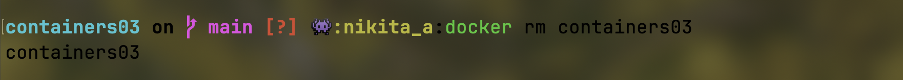

# Лабораторная работа №3: Основы команд Debian/Ubuntu и Docker

---

## Студент

- **Имя и фамилия**: Никита Савка  
- **Группа**: I2302  
- **Платформа**: macOS (Apple M3)  
- **Дата выполнения**: 26 февраля 2025  

---

## Цели и задачи

Цель работы — освоить базовые команды операционных систем Debian/Ubuntu и управление контейнерами в Docker. Основные задачи:  

1. Запустить контейнер на базе Ubuntu через Docker.  
2. Установить веб-сервер Apache внутри контейнера.  
3. Настроить вывод страницы с текстом **"Hello, World!"** в браузере.  
4. Изучить конфигурационные файлы Apache и команды управления контейнерами.  

---

## Ход выполнения

### 1. Подготовка окружения

#### Шаги:  
1. **Установка Docker**:  
   - Загрузил Docker Desktop с [официального сайта](https://www.docker.com/products/docker-desktop) для macOS (M3).  
   - Установил и запустил приложение.  
   - Проверил версию:  
     ```bash
     docker --version
     ```  
     **Вывод**:  
     ```
     Docker version 27.5.1, build 9f9e405801
     ```  

2. **Создание репозитория**:  
   - Создал репозиторий `containers03` на GitHub.  
   
   


   - Склонировал локально:  
     ```bash
     git clone https://github.com/NikitaBytes/containers03.git
     cd containers03
     ```

3. **Создание README**:  
   - Создал файл `README.md` используя команды 
     ```bash
     touch README.md
     ```
   - Добавил в него содержимое:
     ```bash
     nano README.md
     ```
  

#### Итог:  
Окружение готово для работы с Docker и Git. Файл `README.md` был создан и заполнен содержимым.  

**Скриншоты**:  
- Вывод `docker --version`:   
- Клонирование репозитория:   

---

### 2. Запуск контейнера Ubuntu

#### Шаги:  
1. **Запуск контейнера**:  
   - Выполнил команду:  
     ```bash
     docker run -ti -p 8000:80 --name containers03 ubuntu bash
     ```  
   - **Разбор команды**:  
     - `-ti` — интерактивный режим с терминалом.  
     - `-p 8000:80` — проброс порта (8000 хоста → 80 контейнера).  
     - `--name containers03` — имя контейнера.  
     - `ubuntu` — базовый образ.  
     - `bash` — запуск терминала внутри контейнера.  

#### Итог:  
Контейнер запущен, я внутри терминала (`root@1c8d68b19085:/#`).  

**Скриншот**: Запуск контейнера  
  

---

### 3. Установка и настройка Apache

#### Шаги:  
1. **Обновление и установка**:  
   - Внутри контейнера выполнил:  
     ```bash
     apt update
     apt install apache2 -y
     service apache2 start
     ```  
   - **Разбор**:  
     - `apt update` — обновление списка пакетов.  
     - `apt install apache2 -y` — установка Apache с автоматическим подтверждением.  
     - `service apache2 start` — запуск веб-сервера.  

2. **Проверка**:  
   - Открыл в браузере: `http://localhost:8000`.  
   - Увидел стандартную страницу Apache ("It works!").  
   

#### Итог:  
Apache установлен и работает на порту 80 внутри контейнера.  

**Скриншот**: Установка Apache  
  
 
 

---

### 4. Настройка страницы "Hello, World!"

#### Шаги:  
1. **Проверка файлов**:  
   - Выполнил:  
     ```bash
     ls -l /var/www/html/
     ```  
   - Увидел стандартный `index.html`.  

2. **Изменение содержимого**:  
   - Перезаписал файл:  
     ```bash
     echo '<h1>Hello, World!</h1>' > /var/www/html/index.html
     ```  
  
3. **Проверка в браузере**:  
   - Обновил страницу `http://localhost:8000`.  
   - Увидел текст "Hello, World!".  

#### Итог:  
Страница успешно изменена и отображается в браузере.  

**Скриншот**: Обновленная страница  
  

---

### 5. Изучение конфигурации Apache

#### Шаги:  
1. **Переход к конфигурации**:  
   - Выполнил:  
     ```bash
     cd /etc/apache2/sites-enabled/
     ls -l
     ```  

2. **Просмотр файла**:  
   - Открыл конфигурацию:  
     ```bash
     cat 000-default.conf
     ```  
   - **Ключевые параметры**:  
     - `<VirtualHost *:80>` — сервер слушает порт 80.  
     - `DocumentRoot /var/www/html` — корень сайта.  
     - `ErrorLog`/`CustomLog` — пути к логам.  

#### Итог:  
Ознакомился с базовой структурой конфигурации Apache.  

**Скриншот**: Содержимое `000-default.conf`  
  

---

### 6. Завершение работы

#### Шаги:  
1. **Выход из контейнера**:  
   - Ввел:  
     ```bash
     exit
     ```  
   - Контейнер остановился (статус `Exited`).  

2. **Проверка контейнеров**:  
   - Выполнил:  
     ```bash
     docker ps -a
     ```  

3. **Удаление контейнера**:  
   - Удалил:  
     ```bash
     docker rm containers03
     ```  

#### Итог:  
Контейнер удалён, система очищена.  

**Скриншот**: `Вывод docker ps -a` и `docker ps -a` и удаление контейнера.
  
 

---

## Выводы

1. Docker успешно работает на macOS (M3).  
2. Контейнер Ubuntu запущен, внутри установлен и настроен Apache.  
3. Страница "Hello, World!" отображается в браузере через порт 8000.  
4. Изучены базовые команды `apt` и `service`, а также структура конфигурации Apache.  
5. Отработаны команды Docker: `run`, `ps`, `rm`.  

---

## Источники

1. [Официальная документация Docker](https://docs.docker.com/)  
2. [Ubuntu Packages](https://packages.ubuntu.com/)  
3. [Документация Apache](https://httpd.apache.org/)  

